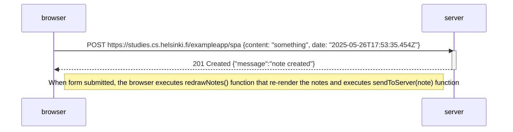

```mermaid
sequenceDiagram
    participant browser
    participant server

    browser->>server: POST https://studies.cs.helsinki.fi/exampleapp/spa {content: "something", date: "2025-05-26T17:53:35.454Z"}
    activate server
    server-->>browser: 201 Created {"message":"note created"}
    deactivate server

    Note right of browser: When form submitted, the browser executes redrawNotes() function that re-render the notes and executes sendToServer(note) function
```
